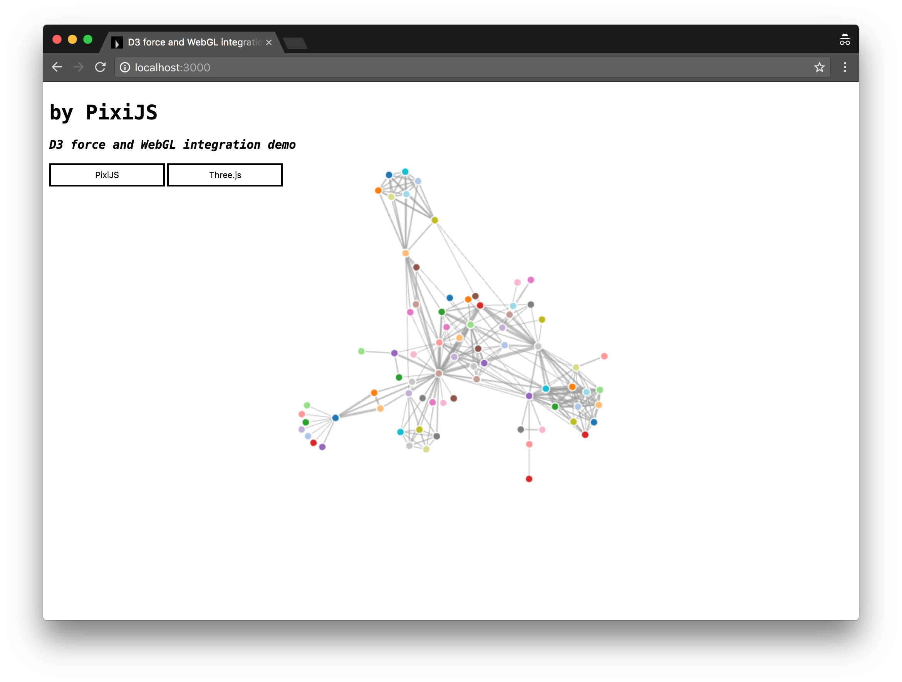

# D3-force and WebGL integration Demo

> Integrating WebGL and D3-force to improve performance.

There is a [online demo](https://geekplux.github.io/d3-force-webgl-integration-demo).

### Preview

### How to run

- git clone https://github.com/geekplux/d3-force-webgl-integration-demo.git  into YourProjectFolder
- cd YourProjectFolder && npm install
- npm start

### Roadmap

- [x] using [Three.js](https://github.com/mrdoob/three.js/)
- [x] using [PixiJS](https://github.com/pixijs/pixi.js)
- [ ] using [regl](https://github.com/regl-project/regl)
- [ ] using origin WebGL

### LICENSE

**D3-force and WebGL integration Demo** &copy; [GeekPlux](https://github.com/geekplux), Released under the [MIT](./LICENSE) License.

---

> Blog [geekplux.com](http://geekplux.com) &nbsp;&middot;&nbsp;
> GitHub [@geekplux](https://github.com/geekplux) &nbsp;&middot;&nbsp;
> Twitter [@geekplux](https://twitter.com/geekplux)
